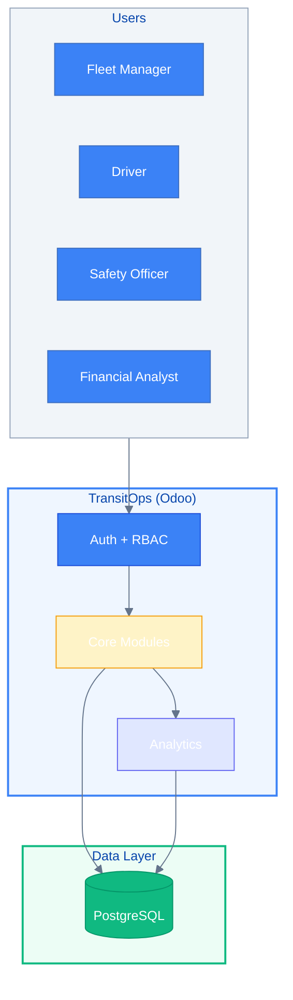
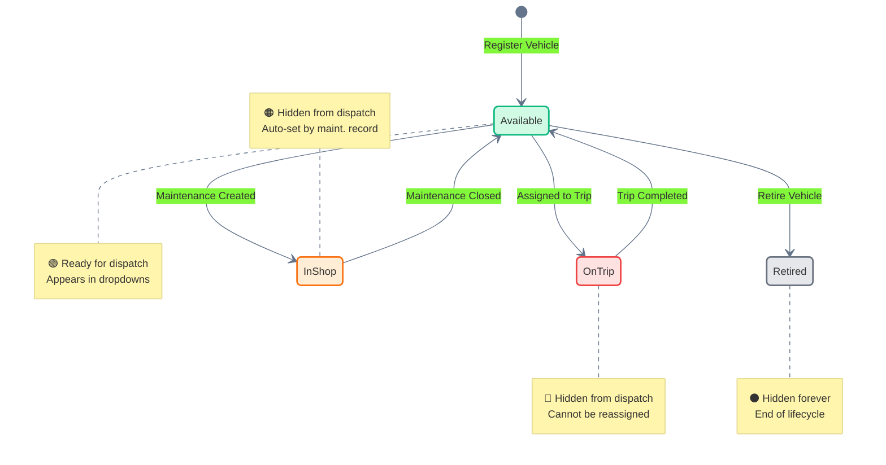
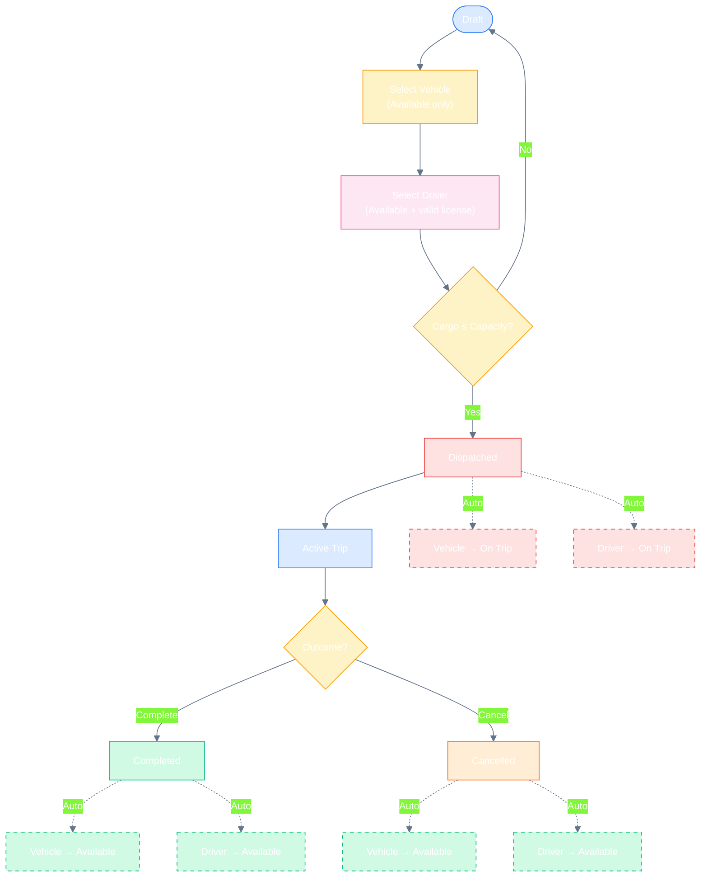
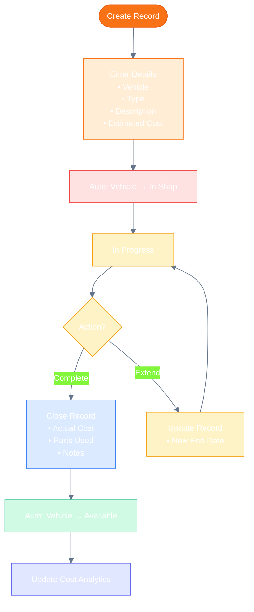
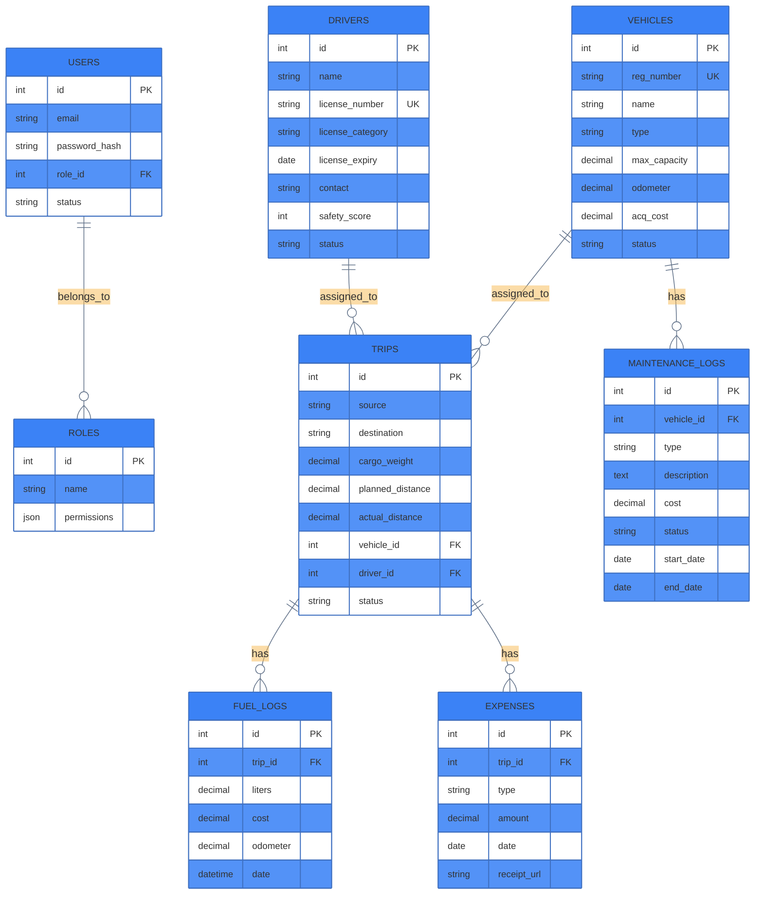

#  TransitOps — Smart Transport Operations Platform

> **Built on Odoo** | End-to-end fleet management for logistics companies.  
> Replaces spreadsheets with a centralized platform for vehicles, drivers, trips, maintenance, and analytics.

---

##  Table of Contents

- [Overview](#-overview)
- [Key Features](#-key-features)
- [User Roles & Permissions](#-user-roles--permissions)
- [System Architecture](#-system-architecture)
- [Core Workflows](#-core-workflows)
  - [Vehicle Lifecycle](#vehicle-lifecycle)
  - [Trip Dispatch Flow](#trip-dispatch-flow)
  - [Maintenance Workflow](#maintenance-workflow)
- [Data Model](#-data-model)
- [Business Rules](#-business-rules)
- [Tech Stack](#-tech-stack)
- [Getting Started](#-getting-started)
- [API Endpoints](#-api-endpoints)
- [Screenshots](#-screenshots)
- [Roadmap](#-roadmap)

---

##  Overview

Many logistics companies still rely on **spreadsheets and manual logbooks** to manage transport operations. This leads to:

- ❌ Scheduling conflicts and double-booked vehicles  
- ❌ Missed maintenance windows and breakdowns  
- ❌ Expired driver licenses going unnoticed  
- ❌ Inaccurate expense tracking and fuel fraud  
- ❌ Poor fleet utilization and underperforming assets  

**TransitOps** solves this by digitizing the **complete lifecycle** of transport operations — from vehicle registration and driver compliance to real-time dispatching, maintenance scheduling, fuel logging, and operational analytics.

---

##  Key Features

| Module | What It Does |
|--------|-------------|
| ** Authentication** | Secure email/password login with Role-Based Access Control (RBAC) |
| ** Dashboard** | Real-time KPIs: Active Vehicles, Fleet Utilization %, Fuel Efficiency, Vehicle ROI |
| ** Vehicle Registry** | Master list with unique registration numbers, capacity, odometer, acquisition cost, and status tracking |
| ** Driver Management** | Profiles with license tracking, safety scores, expiry alerts, and compliance status |
| ** Trip Management** | End-to-end trip lifecycle: Draft → Dispatched → Completed, with automatic status transitions |
| ** Maintenance** | Create maintenance records that auto-set vehicle status to "In Shop" and hide from dispatch |
| ** Fuel & Expenses** | Log fuel consumption and operational expenses (tolls, parking, fines) with automatic cost aggregation |
| **Reports & Analytics** | Fuel efficiency trends, fleet utilization, operational cost breakdown, and Vehicle ROI calculation |
| ** Export** | CSV export for all reports; PDF export support |

---

##  User Roles & Permissions

| Permission | Fleet Manager | Driver | Safety Officer | Financial Analyst | Admin |
|:-----------|:-------------:|:------:|:--------------:|:-----------------:|:-----:|
| View Dashboard | ✅ | ✅ | ✅ | ✅ | ✅ |
| Vehicle CRUD | ✅ | ❌ | 👁️ Read | ❌ | ✅ |
| Driver CRUD | ✅ | ❌ | ✅ | ❌ | ✅ |
| Create Trips | ✅ | ✅ | ❌ | ❌ | ✅ |
| Dispatch Trips | ✅ | ❌ | ❌ | ❌ | ✅ |
| Maintenance | ✅ | ❌ | ✅ | 👁️ Read | ✅ |
| Fuel/Expense Logs | ✅ | ✅ | ❌ | ✅ | ✅ |
| Reports & Export | ✅ | ❌ | ✅ | ✅ | ✅ |
| RBAC & Settings | ❌ | ❌ | ❌ | ❌ | ✅ |

> **Legend:** ✅ Full Access | 👁️ Read Only | ❌ No Access

---

##  System Architecture



**Architecture Highlights:**
- **Frontend:** Odoo Web Client (responsive, works on desktop & mobile)
- **Backend:** Odoo Framework (Python)
- **Database:** PostgreSQL
- **Auth:** Built-in Odoo authentication with custom RBAC extensions
- **Reporting:** Odoo QWeb reports + custom analytics dashboards

---

## Core Workflows

### Vehicle Lifecycle

Vehicles move through 4 states. Status changes are **automatic** — never manual.



**Status Rules:**
- Only **Available** vehicles appear in trip dispatch dropdowns
- **In Shop** and **Retired** vehicles are automatically hidden
- Registration numbers must be **unique** across the fleet

---

### Trip Dispatch Flow

The heart of TransitOps. A trip moves from Draft → Dispatched → Completed with full validation and auto-status updates.



**Validation Rules:**
- Cargo weight must **not exceed** vehicle's maximum load capacity
- Only **Available** vehicles and drivers can be selected
- Drivers with **expired licenses** or **Suspended** status are blocked
- A driver or vehicle already **On Trip** cannot be assigned again

**Auto-Actions:**
- Dispatching → Vehicle & Driver status → **On Trip**
- Completing → Vehicle & Driver status → **Available**
- Cancelling → Vehicle & Driver status → **Available**

---

### Maintenance Workflow

Maintenance records automatically manage vehicle availability — no manual status toggling needed.



---

## 🗄️ Data Model



---

##  Business Rules

| # | Rule | Enforced By |
|---|------|-------------|
| 1 | Vehicle registration number must be **unique** | Database constraint + form validation |
| 2 | Retired or In Shop vehicles **never** appear in dispatch selection | Filter on dropdown query |
| 3 | Drivers with expired licenses or Suspended status **cannot** be assigned to trips | Pre-dispatch validation |
| 4 | A driver or vehicle already On Trip **cannot** be assigned to another trip | Status check on selection |
| 5 | Cargo weight must **not exceed** vehicle's maximum load capacity | Weight validation before dispatch |
| 6 | Dispatching a trip automatically changes both vehicle and driver status to **On Trip** | Auto-action on state change |
| 7 | Completing a trip automatically changes both vehicle and driver status back to **Available** | Auto-action on state change |
| 8 | Cancelling a dispatched trip restores vehicle and driver to **Available** | Auto-action on cancellation |
| 9 | Creating an active maintenance record automatically changes vehicle status to **In Shop** | Auto-action on record creation |
| 10 | Closing maintenance restores vehicle to **Available** (unless retired) | Auto-action on record close |

---

## Tech Stack

| Layer | Technology |
|-------|-----------|
| **Framework** | Odoo (Open Source ERP) |
| **Language** | Python 3 |
| **Database** | PostgreSQL |
| **Frontend** | Odoo Web Client (XML/QWeb + JavaScript) |
| **ORM** | Odoo ORM |
| **Reports** | Odoo QWeb + wkhtmltopdf |
| **Auth** | Odoo built-in + custom RBAC |

---

## Getting Started

### Prerequisites

- Python 3.10+
- PostgreSQL 14+
- Odoo 16+ (Community or Enterprise)

### Installation

```bash
# 1. Clone the repository
git clone https://github.com/your-org/transitops.git
cd transitops

# 2. Install dependencies
pip install -r requirements.txt

# 3. Configure database connection
cp config/odoo.conf.example config/odoo.conf
# Edit config/odoo.conf with your PostgreSQL credentials

# 4. Initialize the database
python odoo-bin -c config/odoo.conf -i transitops --stop-after-init

# 5. Start the server
python odoo-bin -c config/odoo.conf
```

### Default Login

| Role | Email | Password |
|------|-------|----------|
| Admin | admin@transitops.local | admin |
| Fleet Manager | fleet@transitops.local | fleet123 |
| Driver | driver@transitops.local | driver123 |

> ⚠️ Change default passwords immediately after first login.

---

## 🔌 API Endpoints

TransitOps exposes standard Odoo JSON-RPC and XML-RPC APIs. Key models:

| Model | Purpose |
|-------|---------|
| `transitops.vehicle` | Vehicle CRUD operations |
| `transitops.driver` | Driver CRUD operations |
| `transitops.trip` | Trip creation, dispatch, completion |
| `transitops.maintenance` | Maintenance records |
| `transitops.fuel_log` | Fuel consumption logs |
| `transitops.expense` | Operational expenses |
| `transitops.report` | Analytics and KPIs |

### Example: Create a Vehicle (JSON-RPC)

```json
{
  "jsonrpc": "2.0",
  "method": "call",
  "params": {
    "service": "object",
    "method": "execute_kw",
    "args": [
      "transitops",
      1,
      "password",
      "transitops.vehicle",
      "create",
      [{
        "reg_number": "VAN-05",
        "name": "Delivery Van 05",
        "type": "van",
        "max_capacity": 500,
        "odometer": 12330,
        "acq_cost": 25000
      }]
    ]
  }
}
```

---

## 📸 Screenshots

> *Screenshots will be added here. Key views to capture:*
> - Dashboard with KPI cards
> - Vehicle registry list view
> - Trip creation form with validation
> - Maintenance calendar view
> - Fuel efficiency trend chart
> - Dark mode toggle

---

## 🗺️ Roadmap

| Phase | Feature | Status |
|-------|---------|:------:|
| **MVP** | Authentication, Vehicles, Drivers, Trips, Maintenance | ✅ Done |
| **v1.1** | Fuel & Expense tracking, Dashboard KPIs | ✅ Done |
| **v1.2** | Reports with CSV/PDF export | ✅ Done |
| **v1.3** | Charts & visual analytics | 🚧 In Progress |
| **v1.4** | Email reminders for expiring licenses | 📋 Planned |
| **v1.5** | Vehicle document management | 📋 Planned |
| **v1.6** | Advanced search, filters, sorting | 📋 Planned |
| **v2.0** | Dark mode, mobile app, GPS integration | 📋 Planned |

---

##  Contributing

1. Fork the repository
2. Create a feature branch: `git checkout -b feature/amazing-feature`
3. Commit your changes: `git commit -m 'Add amazing feature'`
4. Push to the branch: `git push origin feature/amazing-feature`
5. Open a Pull Request

Please read our [Contributing Guide](CONTRIBUTING.md) for details on code style, testing, and commit conventions.

---

##  License

This project is licensed under the **LGPL-3.0 License** — see the [LICENSE](LICENSE) file for details.

---

## Acknowledgments

- Built for the **TransitOps Hackathon** (8-hour challenge)
- Powered by [Odoo](https://www.odoo.com/) — the world's easiest all-in-one management software
- Icons by [Lucide](https://lucide.dev/)

---

<div align="center">

**[⬆ Back to Top](#-transitops--smart-transport-operations-platform)**

Made with ❤️ by the TransitOps Team

</div>
